## <u>Topics</u>
## - [Materias](#Materias)
## - [Cowbells (Extreme II)](#Cowbells-\(Extreme-II\))

# Materias
<table>
    <th>Materias</th>
    <th>Level 1</th>
    <th>Level 2</th>
    <th>Level 3</th>
    <tr>
        <td>Heal: Give HP</td>
        <td>100 HP</td>
        <td>150 HP</td>
        <td>Invulnerability (6 secs) + 225 HP</td>
    </tr>
    <tr>
        <td>Ice (6 secs): <b>Stops zombies</b></td>
        <td>Small region</td>
        <td>Big region</td>
        <td>Bigger region</td>
    </tr>
    <tr>
        <td>Fire</td>
        <td>Small ignited cone</td>
        <td>5 secs: Firewall follows you</td>
        <td>Huge area</td>
    </tr>
    <tr>
        <td>Wind</td>
        <td>Small push</td>
        <td>Big push</td>
        <td>Tornado push</td>
    </tr>
    <tr>
        <td>Electro: Leaves area that slows and damages zombies</td>
        <td>1 charge</td>
        <td>2 charges</td>
        <td>3 charges</td>
    </tr>
    <tr>
        <td>Earth: Creates a big rock that traps zombies</td>
        <td>All the same</td>
        <td>-</td>
        <td>-</td>
    </tr>
    <tr>
        <td>Gravity: Sucks zombies in a hole (slows them a bit after)</td>
        <td>All the same</td>
        <td>-</td>
        <td>-</td>
    </tr>
    <tr>
        <td>Ultima</td>
        <td>Not in Normal</td>
        <td>20 seconds -> Kill zombies or damage boss a lot</td>
        <td>-</td>
    </tr>
</table>

# Cowbells (Extreme II)
<table>
    <th></th>
    <th>1: Brothel (2) and Above last spawn window (1)</th>
    <th>2: Cinema(1)</th>
    <tr>
        <th> 1 to 4 (Brothel/Building and Cinema) </th>
        <td>
            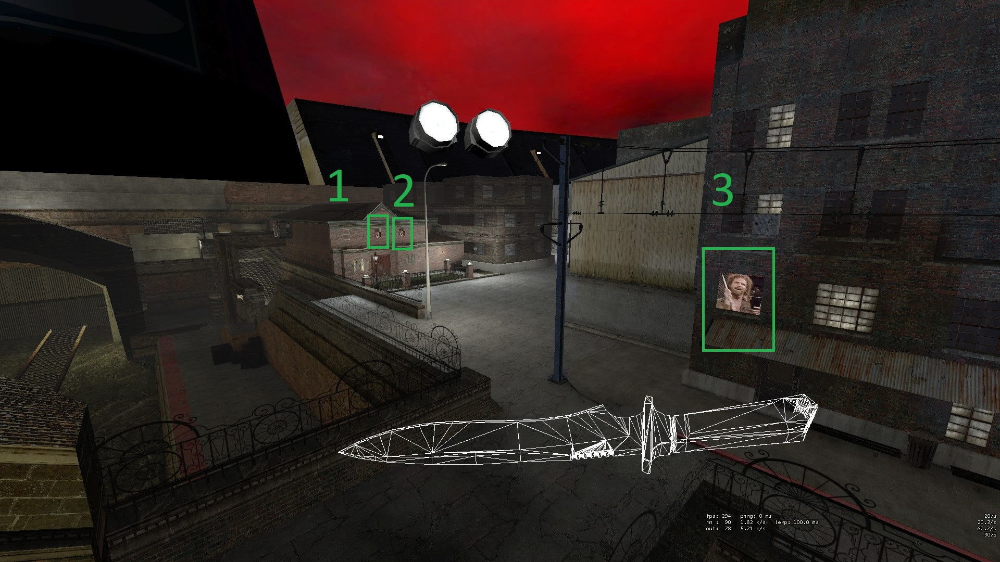</img>
        </td>
        <td>
            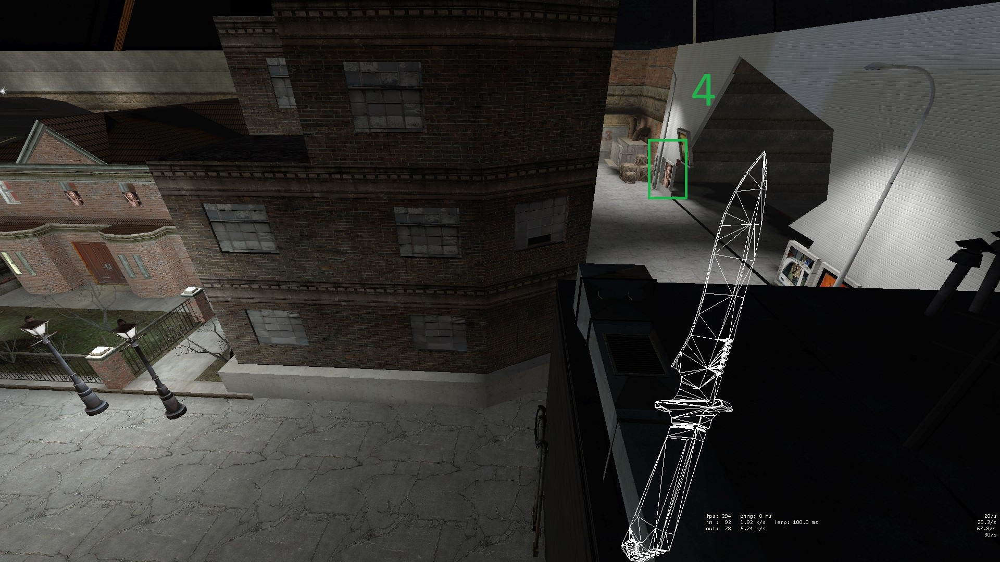</img>
        </td>
    </tr>
</table>
<table>
    <th></th>
    <th>5: Back truck window (1)</th>
    <th>6: Ultima window (1)</th>
    <th>7A: Behind cage, inside wooden shed (1)</th>
    <th>7B: Back truck window (1)</th>
    <tr>
        <th>5-7 (Back and Pipes side)</th>
        <td>
            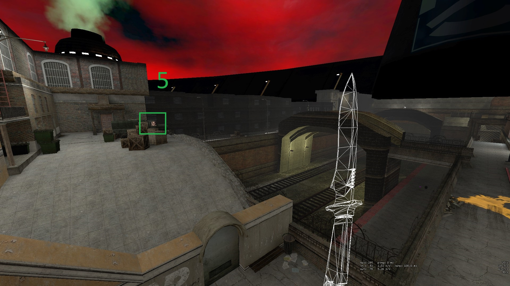</img>
        </td>
        <td>
            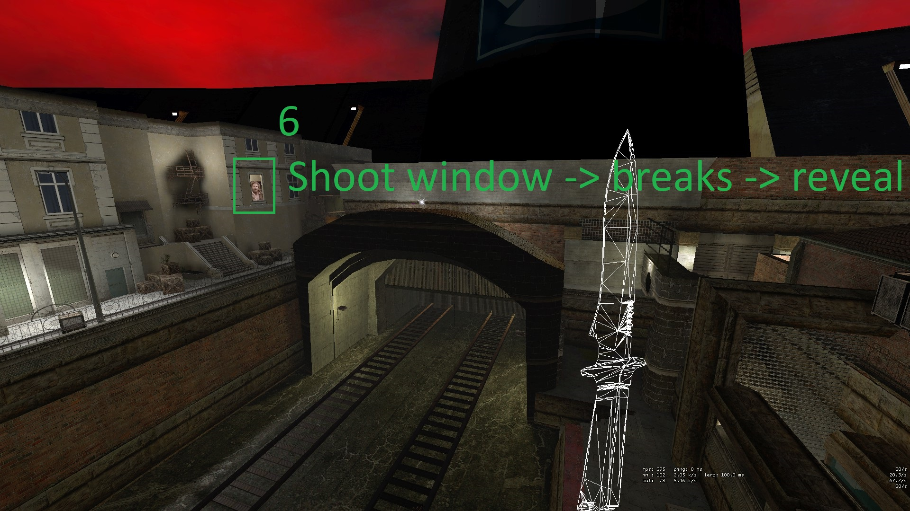</img>
        </td>
        <td>
            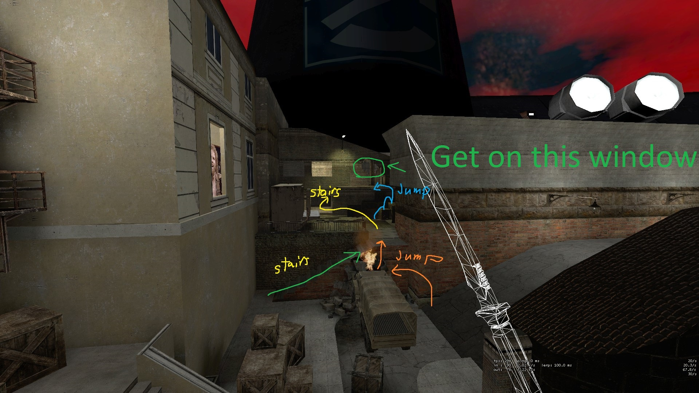</img>
        </td>
        <td>
            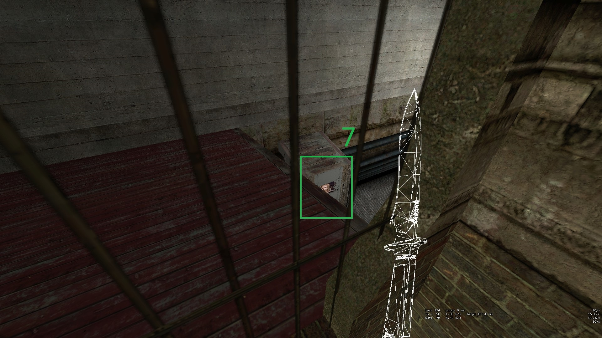</img>
        </td>
    </tr>
</table>
<table>
    <th></th>
    <th>8: Wall of the intersecting bridge</th>
    <th>9: Under the stairs of the first "bridge to elevator" door</th>
    <th>10: Under the glass of the second "bridge to elevator" door</th>
    <th>11: Above the elevator</th>
    <tr>
        <th>8 - 11 (Bridge Section)</th>
        <td>
            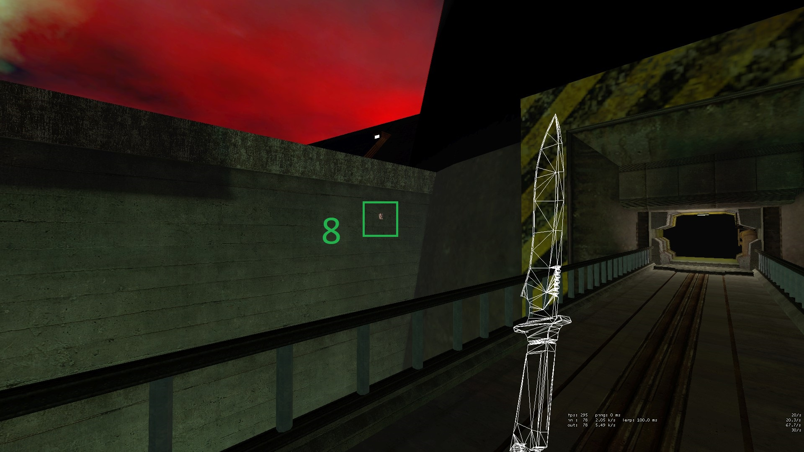</img>
        </td>
        <td>
            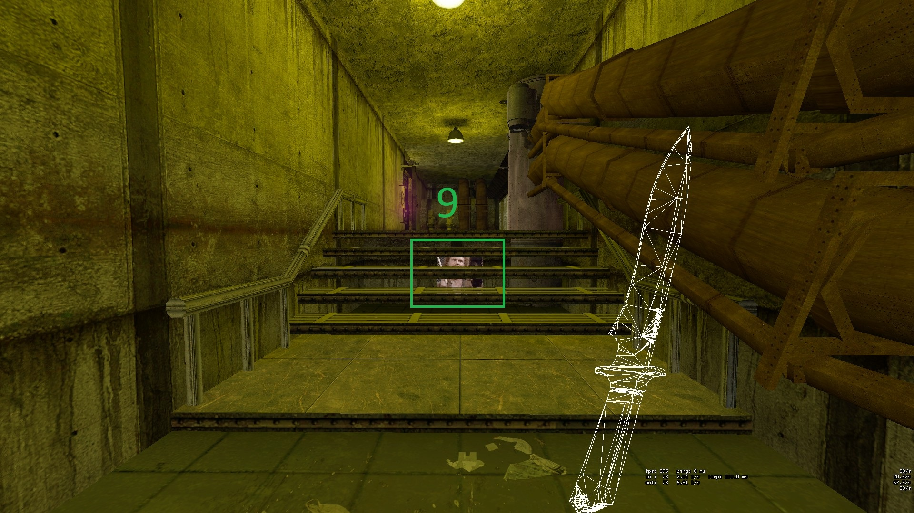</img>
        </td>
        <td>
            </img>
        </td>
        <td>
            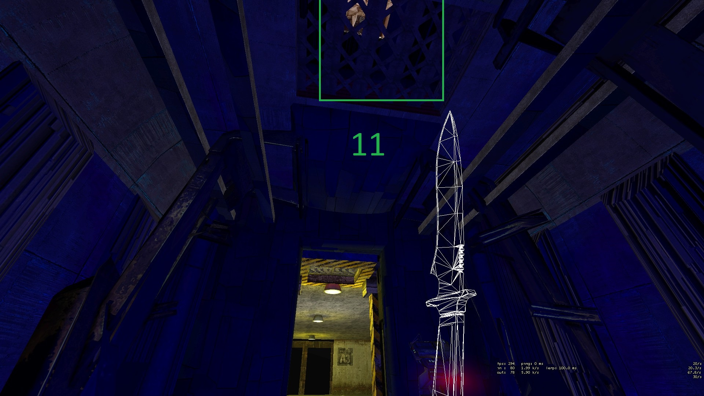</img>
        </td>
    </tr>
</table>
<table>
    <th></th>
    <th>8: Wall of the intersecting bridge</th>
    <th>9: Under the stairs of the first "bridge to elevator" door</th>
    <th>10: Under the glass of the second "bridge to elevator" door</th>
    <th>11: Above the elevator</th>
    <tr>
        <th>8 - 11 (Bridge Section)</th>
        <td>
            </img>
        </td>
        <td>
            </img>
        </td>
        <td>
            </img>
        </td>
        <td>
            </img>
        </td>
    </tr>
</table>
<table>
    <th></th>
    <th>12: After elevator to stairs</th>
    <th>13: Jump to pipe ladder</th>
    <th>14 - 15: On pipe and Boss stage</th>
    <tr>
        <th>12 - 15 (Elevator to Boss)</th>
        <td>
            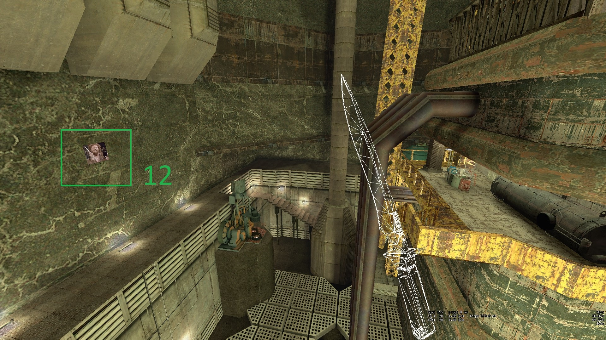</img>
        </td>
        <td>
            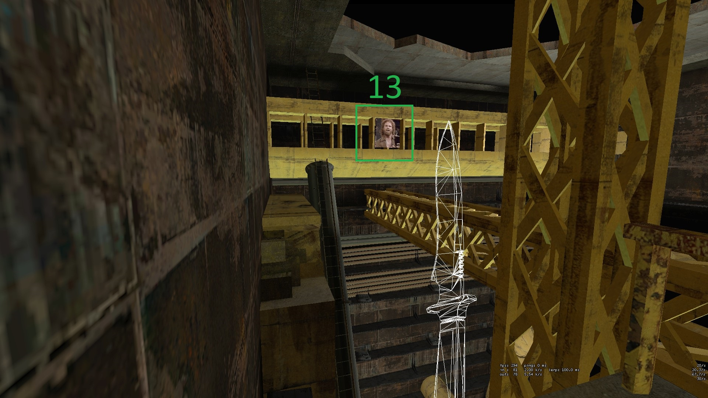</img>
        </td>
        <td>
            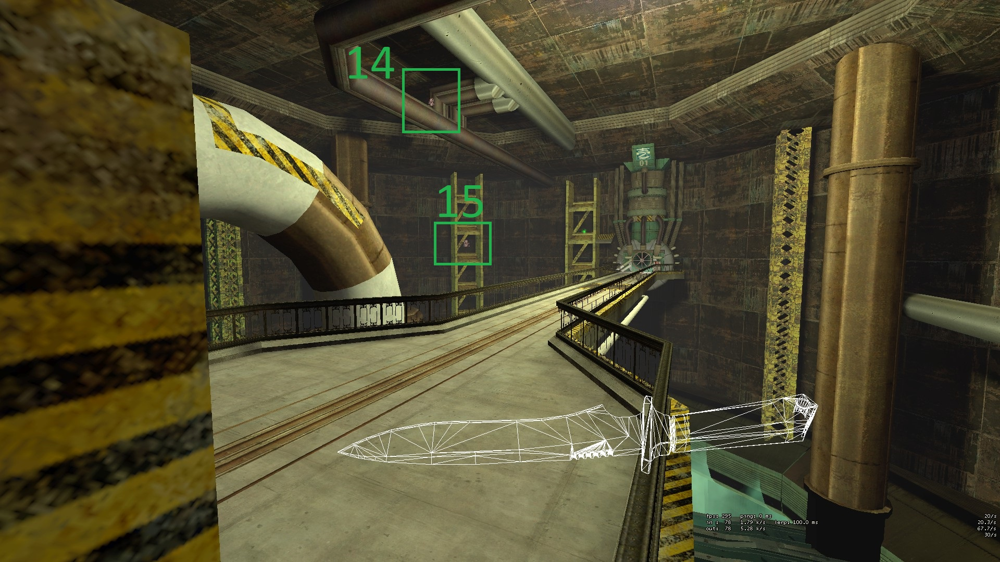</img>
        </td>
    </tr>
</table>
