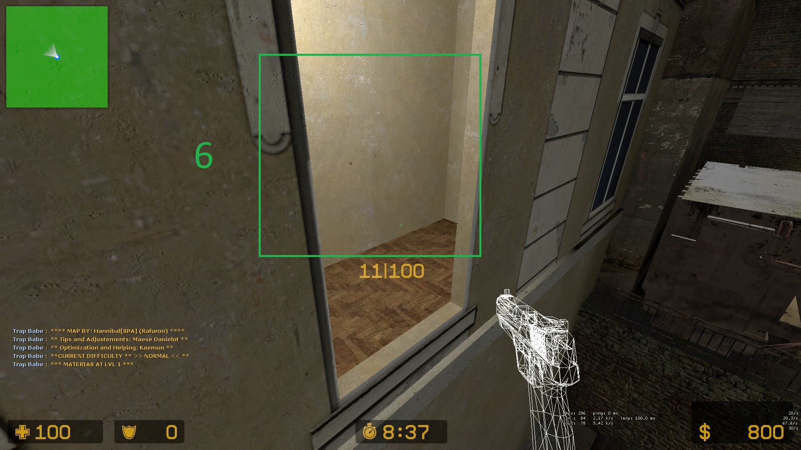

## <u>Topics</u>
## - [Materias](#Materias)
## - [Cowbells (Extreme II)](#Cowbells-Extreme-II)

# Materias
<table>
    <th>Materias</th>
    <th>Basic Idea</th>
    <th>Level 1</th>
    <th>Level 2</th>
    <th>Level 3</th>
    <th>Boss Damage (Don't have to be near to damage boss)</th>
    <tr>
        <td>Heal</td>
        <td>Give HP</td>
        <td>100 HP</td>
        <td>150 HP</td>
        <td>Invulnerability (6 secs) + 225 HP</td>
        <td>-</td>
    </tr>
    <tr>
        <td>Ice (6 secs)</td>
        <td>Stops zombies</td>
        <td>Small region in front</td>
        <td>Big region in front</td>
        <td>Bigger region</td>
        <td>Delay Bahamuts attack by 5 secs</td>
    </tr>
    <tr>
        <td>Fire</td>
        <td>Ignite zombies</td>
        <td>1 sec: In front of you</td>
        <td>5 secs: Firewall follows you</td>
        <td>5 secs: Huge area</td>
        <td>175 HP</td>
    </tr>
    <tr>
        <td>Wind</td>
        <td>Push zombies</td>
        <td>Small push</td>
        <td>Big push</td>
        <td>Tornado push</td>
        <td>-</td>
    </tr>
    <tr>
        <td>Electro</td>
        <td>Leaves area that slows and damages zombies</td>
        <td>1 charge</td>
        <td>2 charges</td>
        <td>3 charges</td>
        <td>85 HP per charge</td>
    </tr>
    <tr>
        <td>Earth (7 secs)</td>
        <td>Creates a big rock that traps zombies</td>
        <td>-</td>
        <td>-</td>
        <td>-</td>
        <td>-</td>
    </tr>
    <tr>
        <td>Gravity (7 secs?)</td>
        <td>Sucks zombies in a hole (slows them a bit after)</td>
        <td>-</td>
        <td>-</td>
        <td>-</td>
        <td>135 HP</td>
    </tr>
    <tr>
        <td>Ultima</td>
        <td>20 seconds -> Kill zombies on that floor or damage boss a lot</td>
        <td>Not in Normal</td>
        <td>-</td>
        <td>-</td>
        <td>1750 HP</td>
    </tr>
</table>

# Materia Locations
<table>
    <tr>
        <th>4 Ultima Specific Locations (6/12/16/21)</th>
        <th></th>
        <th></th>
        <th></th>
        <th></th>
        <th></th>
    </tr>
    <tr>
        <th>2 Earth Specific Locations (23/22)</th>
        <th></th>
        <th></th>
        <th></th>
        <th></th>
    </tr>
    <tr>
        <th>Spawn Locations</th>
        <th></th>
        <th></th>
        <th></th>
        <th></th>
        <th></th>
        <th></th>
    </tr>
    <tr>
        <th>Spawn Door</th>
        <th></th>
        <th></th>
    </tr>
        <tr>
        <th>Door to Bridge</th>
        <th></th>
    </tr>
    </tr>
        <tr>
        <th>1st Door to Elevator</th>
        <th></th>
    </tr>
    </tr>
        <tr>
        <th>2nd Door to Elevator</th>
        <th></th>
    </tr>
    </tr>
        <tr>
        <th>After Elevator</th>
        <th></th>
        <th></th>
        <th></th>
    </tr>
    </tr>
        <tr>
        <th>Pipes to Boss</th>
        <th></th>
        <th></th>
        <th></th>
    </tr>
</table>

# Cowbells (Extreme II)
<table>
    <th></th>
    <th>1: Brothel (2) and Above last spawn window (1)</th>
    <th>2: Cinema (1)</th>
    <tr>
        <th> 1 to 4 (Brothel/Building and Cinema) </th>
        <td>
            </img>
        </td>
        <td>
            </img>
        </td>
    </tr>
</table>
<table>
    <th></th>
    <th>5: Back truck window (1)</th>
    <th>6: Ultima window (1)</th>
    <th>7A: Behind cage, inside wooden shed (1)</th>
    <th>7B: Back truck window (1)</th>
    <tr>
        <th>5-7 (Back and Pipes side)</th>
        <td>
            </img>
        </td>
        <td>
            </img>
        </td>
        <td>
            </img>
        </td>
        <td>
            </img>
        </td>
    </tr>
</table>
<table>
    <th></th>
    <th>8: Wall of the intersecting bridge</th>
    <th>9: Under the stairs of the first "bridge to elevator" door</th>
    <th>10: Under the glass of the second "bridge to elevator" door</th>
    <th>11: Above the elevator</th>
    <tr>
        <th>8 - 11 (Bridge Section)</th>
        <td>
            </img>
        </td>
        <td>
            </img>
        </td>
        <td>
            </img>
        </td>
        <td>
            </img>
        </td>
    </tr>
</table>
<table>
    <th></th>
    <th>12: After elevator to stairs</th>
    <th>13: Jump to pipe ladder</th>
    <th>14 - 15: On pipe and Boss stage</th>
    <tr>
        <th>12 - 15 (Elevator to Boss)</th>
        <td>
            </img>
        </td>
        <td>
            </img>
        </td>
        <td>
            </img>
        </td>
    </tr>
</table>
